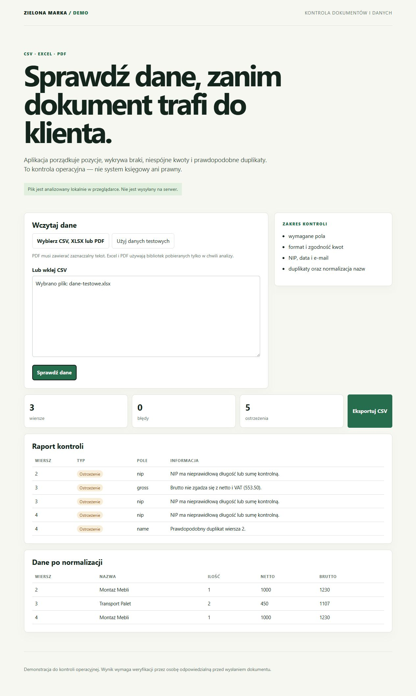

# Document Checker

Demonstracja kontroli dokumentów i danych przed wysłaniem do klienta.



## Zakres

- CSV, XLS/XLSX oraz PDF z zaznaczalnym tekstem;
- rozpoznanie podstawowych pól pozycji dokumentu;
- normalizacja nazw i wartości;
- kontrola wymaganych pól, kwot netto/brutto/VAT, NIP-u, daty, e-maila oraz prawdopodobnych duplikatów;
- eksport znormalizowanego CSV.

## Ważne ograniczenie

To narzędzie jest wsparciem kontroli operacyjnej. Nie zastępuje systemu księgowego, kontroli prawnej ani integracji KSeF. Każdy raport wymaga weryfikacji przez osobę odpowiedzialną.

## Prywatność demonstracji

Dane są przetwarzane lokalnie w przeglądarce. Odczyt pliku XLS/XLSX lub PDF pobiera bibliotekę techniczną z CDN, ale sam plik nie jest wysyłany do aplikacji ani zapisywany na serwerze.

## Testy

```bash
npm test
```

Testy sprawdzają parser CSV, normalizację, wykrywanie rozbieżności kwot, NIP-u i duplikatu oraz konwersję tekstu dokumentu do kontrolowanego rekordu.

Folder `samples/` zawiera wyłącznie fikcyjne dane do ręcznej weryfikacji działania CSV oraz PDF.

## Uruchomienie

To statyczna aplikacja bez procesu instalacji. Otwórz `index.html` albo uruchom dowolny lokalny serwer HTTP w katalogu projektu.
